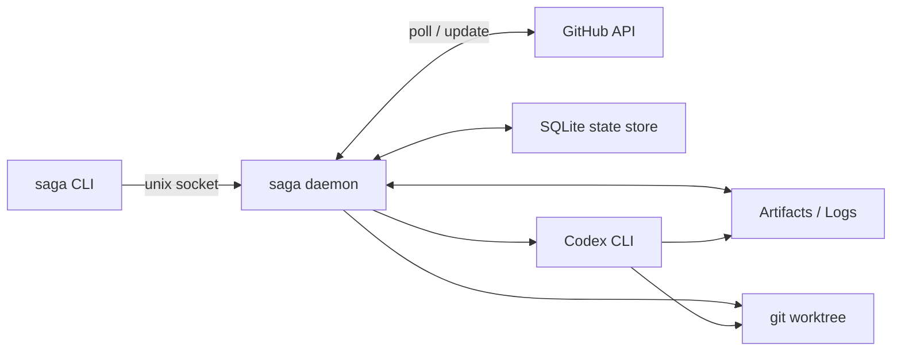
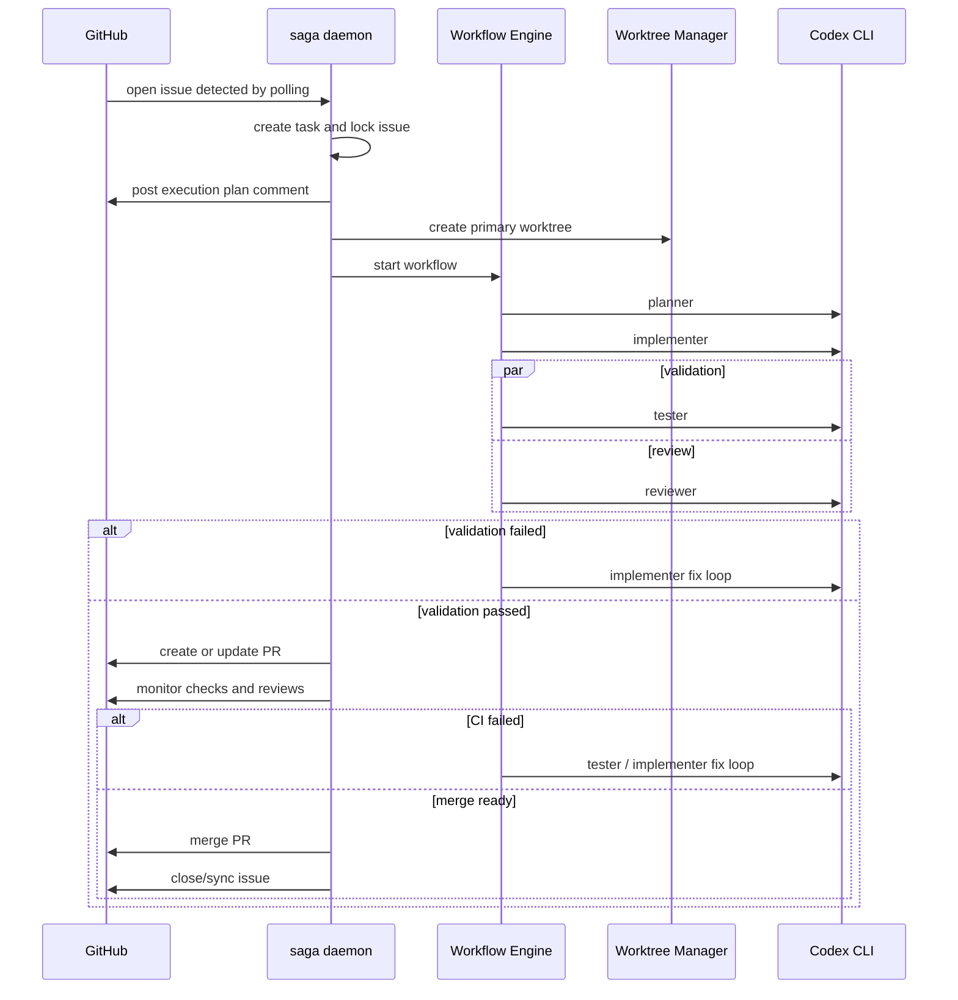

# Saga Architecture

## 1. 設計原則

- 制御は Go コードに集約し、AI には作業実行のみを任せる
- 実行単位は task/run/subagent に分離し、状態は永続化する
- GitHub 連携は v1 から自動化するが、外部公開 webhook に依存しない
- worktree 分離と段階的 sandbox により破壊半径を抑える
- 復旧可能性を最初から設計に含める

## 2. システム全体像



## 3. 主要コンポーネント

### 3.1 Daemon

責務:

- GitHub Issue/PR のポーリングと同期
- queue 管理
- workflow 実行制御
- subagent プロセス管理
- state/log/artifact 永続化
- systemd 連携

公開インターフェース:

- Unix domain socket: `/run/saga/saga.sock`
- ローカル CLI 経由で `enqueue/status/cancel/retry/resume`

### 3.2 Workflow Engine

責務:

- YAML workflow の読み込み
- stage 遷移の判定
- parallel stage の実行
- fix loop の制御
- artifact の受け渡し

最小 stage 属性:

- `name`
- `role`
- `sandbox`
- `network`
- `timeout`
- `retry`
- `transition`
- `worktree_mode`

### 3.3 Subagent Runner

責務:

- Codex CLI プロセス起動
- stage 別の prompt 組み立て
- sandbox/network/env の適用
- stdout/stderr/result の取得
- timeout/cancel/kill の制御

v1 方針:

- Codex CLI の内部 session 継続に依存しない
- framework 側で artifact と stage 入出力を保持し、再実行可能にする
- Codex CLI が stable に resume 機構を公開する場合のみ拡張で利用する

### 3.4 Worktree Manager

責務:

- primary worktree 作成
- validate 用 shadow worktree 作成
- branch 命名
- cleanup
- orphan recovery

方針:

- `implementer` は primary worktree を編集する
- `tester/reviewer/verifier` は shadow worktree または read-only 実行を使う

### 3.5 GitHub Sync Engine

責務:

- 取り込み対象 Issue の検出
- Issue/PR/Checks/Reviews の状態取得
- コメント投稿
- PR 作成・更新・マージ
- 再起動後の再同期

v1 方針:

- 主方式は polling + reconciliation
- webhook は将来拡張

### 3.6 State Store

責務:

- task, run, subagent, GitHub sync, checkpoint, lease の永続化
- 排他制御
- 再開処理のためのソースオブトゥルース

採用:

- SQLite

### 3.7 Artifact / Log Store

責務:

- run ごとの trace 保存
- subagent 出力保存
- PR/Issue 用テンプレートや中間生成物の保管

## 4. 実行シーケンス



## 5. 状態モデル

### 5.1 Task State

- `discovered`
- `queued`
- `running`
- `waiting_external`
- `validating`
- `merging`
- `completed`
- `failed`
- `cancelled`
- `suspended`

### 5.2 Run State

- `created`
- `planning`
- `implementing`
- `testing`
- `reviewing`
- `verifying`
- `creating_pr`
- `watching_ci`
- `fixing_ci`
- `merging_pr`
- `done`
- `error`

### 5.3 Subagent State

- `pending`
- `starting`
- `running`
- `succeeded`
- `failed`
- `timed_out`
- `cancelled`

## 6. 配置ディレクトリ

`systemd` の `StateDirectory`, `RuntimeDirectory`, `LogsDirectory` を使う前提で、標準配置を次のようにする。

```text
/var/lib/saga/
  saga.db
  repos/
  worktrees/
  artifacts/
    <run-id>/
      events.ndjson
      metadata.json
      planner/
      implementer/
      tester/
      reviewer/
      verifier/

/run/saga/
  saga.sock
  locks/
  pids/

/var/log/saga/
  saga.log
```

WSL2 では上記を Linux 側ファイルシステムに置く。`/mnt/c` は IO と権限の観点から非推奨。

## 7. GitHub 自動連携アーキテクチャ

### 7.1 取り込み

- daemon が対象 repository を定期ポーリングする
- selector は label, assignee, state, issue comment command で判定する
- `issue lease` を DB に持ち、二重着火を防ぐ

### 7.2 実行中の同期

- plan comment
- progress comment
- blocked/error comment
- PR create/update
- CI 状態監視
- merge / close sync

### 7.3 再起動後の回復

daemon 起動時に以下を再同期する。

- DB 上 `running` の task
- open PR に紐づく active run
- GitHub 上は存在するが DB に stale な task
- worktree は残るが run が落ちているケース

## 8. systemd / WSL2 運用方針

### 8.1 Unit の考え方

- `Type=notify`
- `Restart=on-failure`
- `KillMode=control-group`
- `TimeoutStopSec` は Codex child の graceful shutdown を考慮する

### 8.2 起動条件

- `After=network-online.target`
- GitHub API と OpenAI/Codex 認証情報が有効
- `Codex CLI` と `git` が PATH 上に存在

### 8.3 ヘルスチェック

- daemon は readiness を systemd に通知する
- `/run/saga/saga.sock` の応答確認
- DB ロックの整合性確認
- GitHub ポーラの最終成功時刻確認

## 9. セキュリティ境界

### 9.1 既定値

- Planner/Reviewer/Verifier: `read-only`
- Implementer/Tester: `workspace-write`
- `full` は stage 単位の明示設定でのみ許可

### 9.2 認証情報

- GitHub token または GitHub App credential は systemd の `EnvironmentFile` または credential で注入
- OpenAI/Codex credential も同様
- artifact や log に secret を出さない redaction を実装する

## 10. 障害時の回復戦略

- Codex プロセス timeout: graceful kill -> force kill
- GitHub API 失敗: exponential backoff + retry
- daemon crash: state store と artifact から replay/reconcile
- worktree 残骸: startup cleanup job で回収
- open PR 残存: GitHub から状態を再取得し DB を補正
